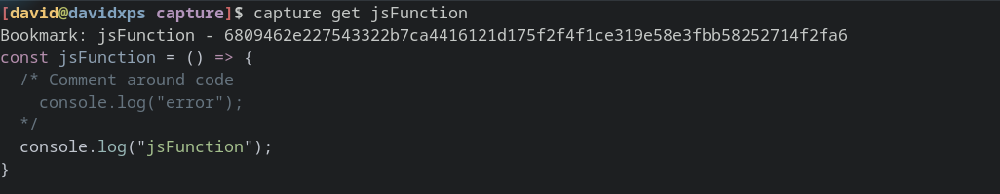
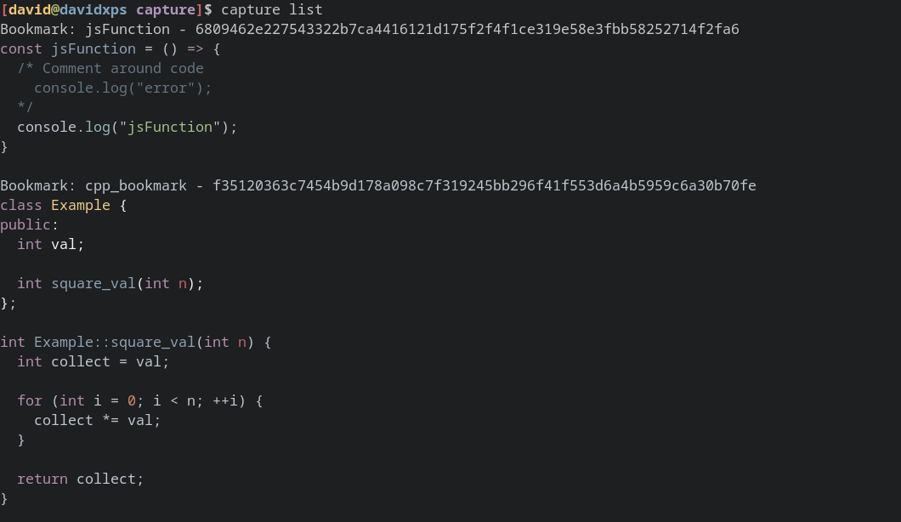

📸 capture
---

Save reusable code by capturing code snippets to share or bookmark them, all directly from the terminal.

### Currently supported languages
* Rust
* Python (except creating snippet without comments)
* Javascript/Typescript
* Golang
* C/C++

### Usage examples
```js
// File: index.js
const jsFunction = () => {
  /* Comment around code
  console.log("error"); */
  console.log("jsFunction");
}
```

#### Create a new snippet
```sh
# Create from function
capture add jsFunction --file index.js function jsFunction

# Create from line interval
capture add jsFunction --file index.js interval 5:15
```

#### Get existing snippet
```sh
capture get jsFunction
```



#### List saved snippets 
```sh
capture list (--oneline)
```


#### Delete a snippet
```sh
capture delete jsFunction
```
